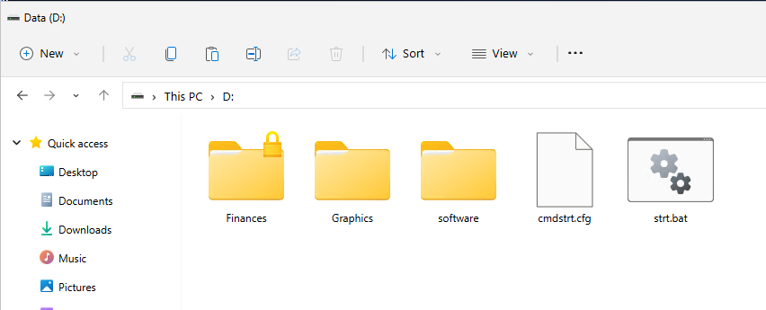
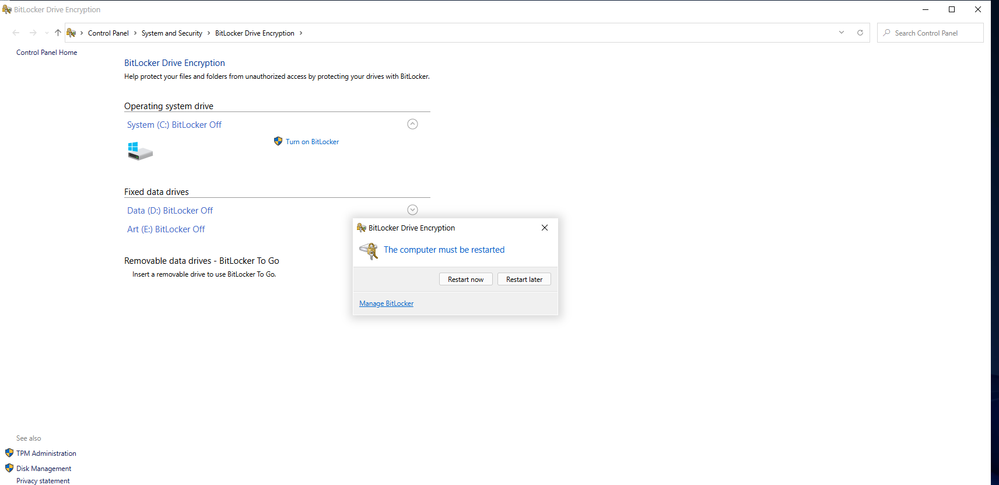
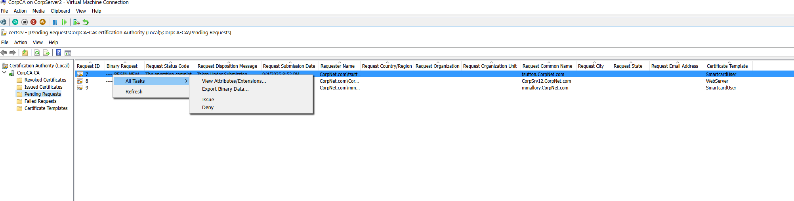
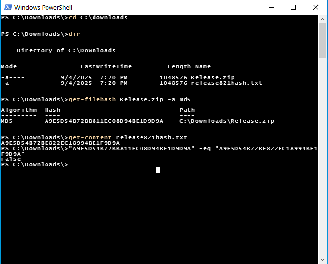
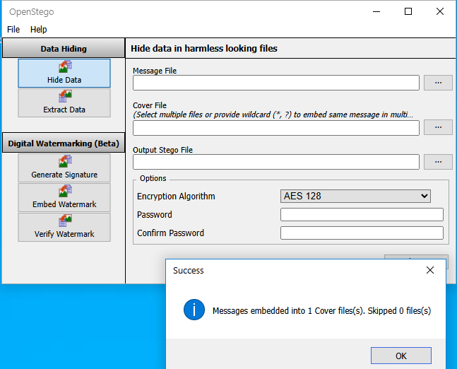

# 🔐 Cryptography & PKI Labs

This lab collection demonstrates key concepts in cryptography, certificate management, and steganography. These activities highlight critical cybersecurity skills such as file and disk encryption, integrity validation, certificate handling, and secure data hiding.

---

## 🔐 Encrypt Files with EFS
- Encrypted the `D:\Finances` folder using **EFS (Encrypting File System)**
- Enabled file-level encryption for protecting sensitive information
- Folder displayed a lock icon indicating encryption was active

**🧠 Why it matters:** EFS helps protect individual files or folders on NTFS volumes without requiring full-disk encryption.

**📸 Screenshot:**  

---

## 💽 Configure BitLocker with TPM
- Enabled BitLocker drive encryption for the **C:** drive
- Utilized **TPM** (Trusted Platform Module) to store the encryption key securely
- Restarted system to apply the policy and begin encryption

**🧠 Why it matters:** BitLocker protects data on lost or stolen devices, especially when combined with hardware-based TPM security.

**📸 Screenshot:**  

---

## 📜 Approve Certificates in CA Console
- Opened **Certificate Authority** console to view pending requests
- Approved smart card login certificate for domain user `tsutton`
- Demonstrated issuing and managing certificates in an enterprise PKI setup

**🧠 Why it matters:** PKI enables strong identity authentication, digital signatures, and secure communications across networks.

**📸 Screenshot:**  

---

## 🧮 Verify File Integrity with MD5
- Used **PowerShell** to generate MD5 hash for a file (`Release.zip`)
- Compared the hash to a provided value in a `.txt` file
- Verified hash mismatch (result: `False`), indicating the file may be altered or corrupted

**🧠 Why it matters:** Hash functions are essential for verifying download integrity and ensuring data has not been tampered with.

**📸 Screenshot:**  

---

## 🖼️ Hide Data Using OpenStego
- Used **OpenStego** to embed a secret message into a cover image
- Selected AES-128 as the encryption algorithm and set a password
- Successfully created a stego file with hidden data

**🧠 Why it matters:** Steganography is a technique used in covert communication and digital watermarking to hide sensitive information.

**📸 Screenshot:**  

---

## ✅ Skills Demonstrated
- Encrypt files and drives using EFS and BitLocker with TPM
- Manage PKI certificates through a Windows Certificate Authority
- Use hashing algorithms for verifying file integrity
- Apply steganography techniques for hiding messages in images
