# 👤 Identity & Access Management Labs

This section showcases hands-on labs focused on managing user identities, groups, and authentication policies in both Windows (Active Directory) and Linux environments. These skills are essential for cybersecurity, system administration, and IT support roles.

Whether you're building a secure domain environment or controlling user access across multiple systems, these labs reflect best practices in identity and access management.

---

## 🧱 Active Directory & Group Policy

- **Created Organizational Units (OUs)** to structure users and computers logically  
  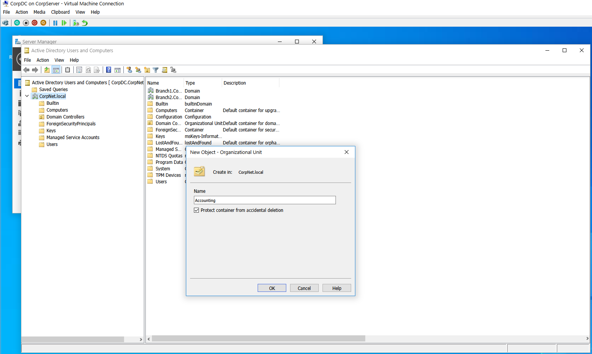

- **Added Users to the Domain** and configured account properties  
  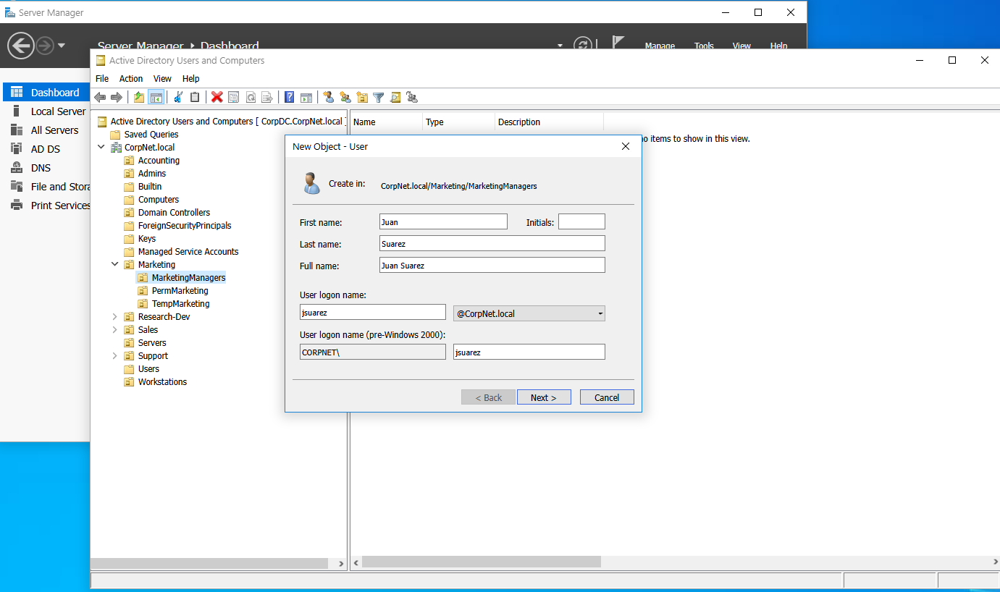  
  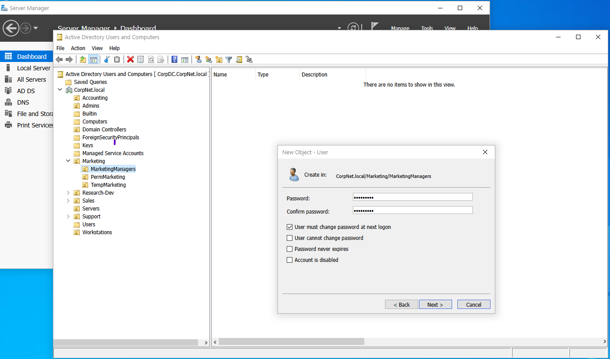

- **Created Security Groups** and managed user memberships  
  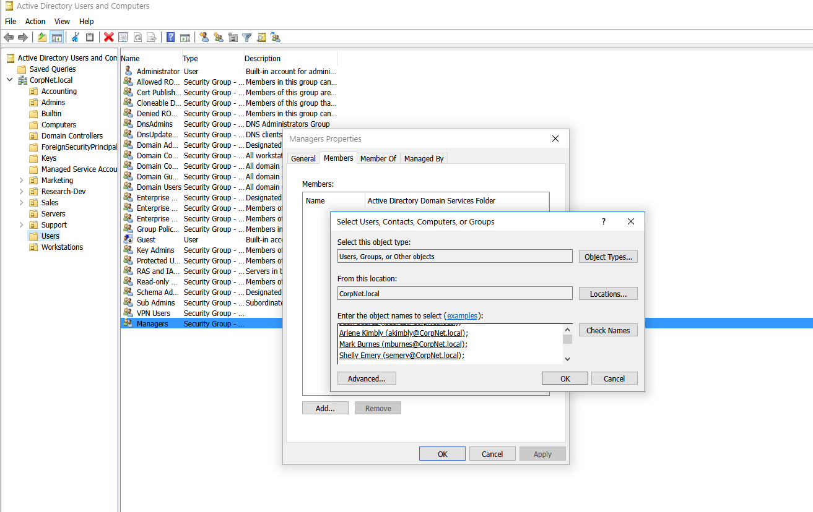

- **Linked Group Policy Objects (GPOs)** to specific OUs for centralized control  
  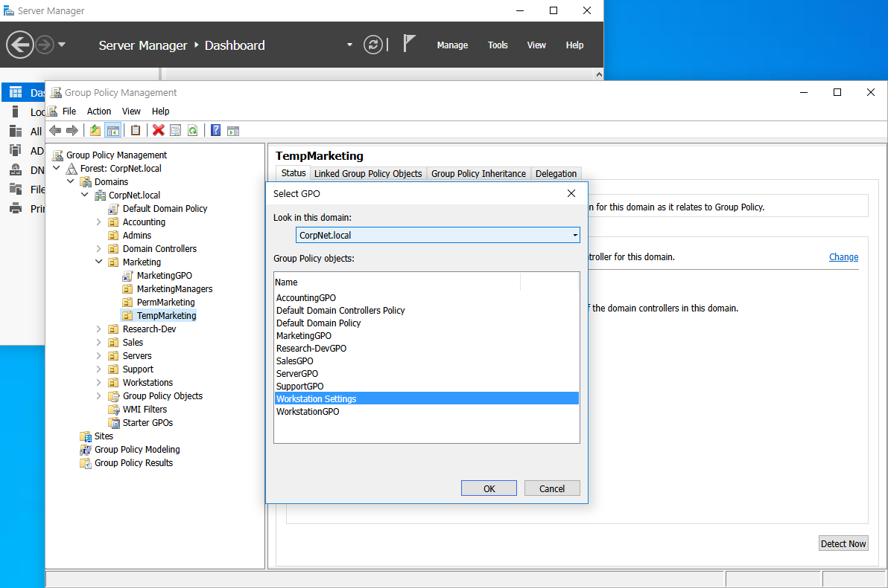

---

## 🪪 Windows Account Security

- **Configured password complexity and lockout settings** via policy editor  
  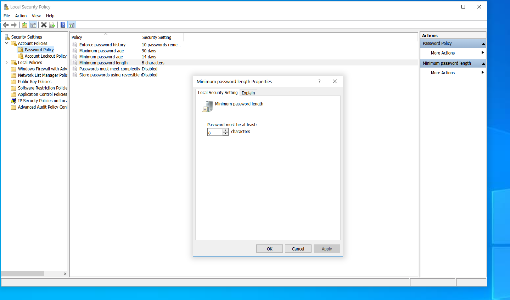

- **Restricted local accounts** to reduce unauthorized access points  
  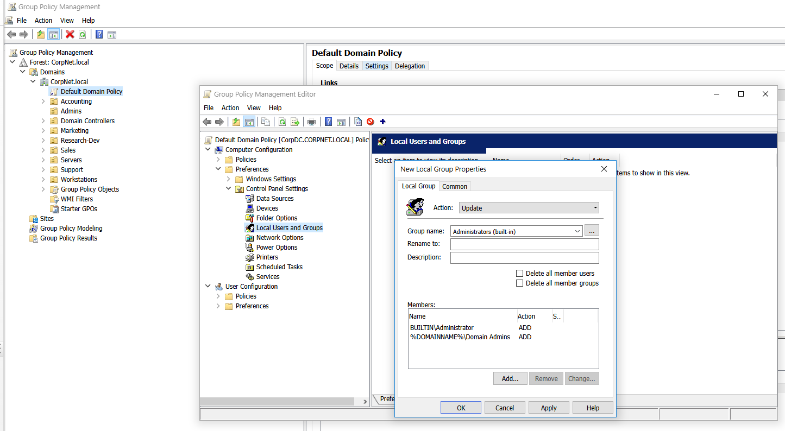

- **Enforced User Account Control (UAC)** for elevation prompts and privilege management  
  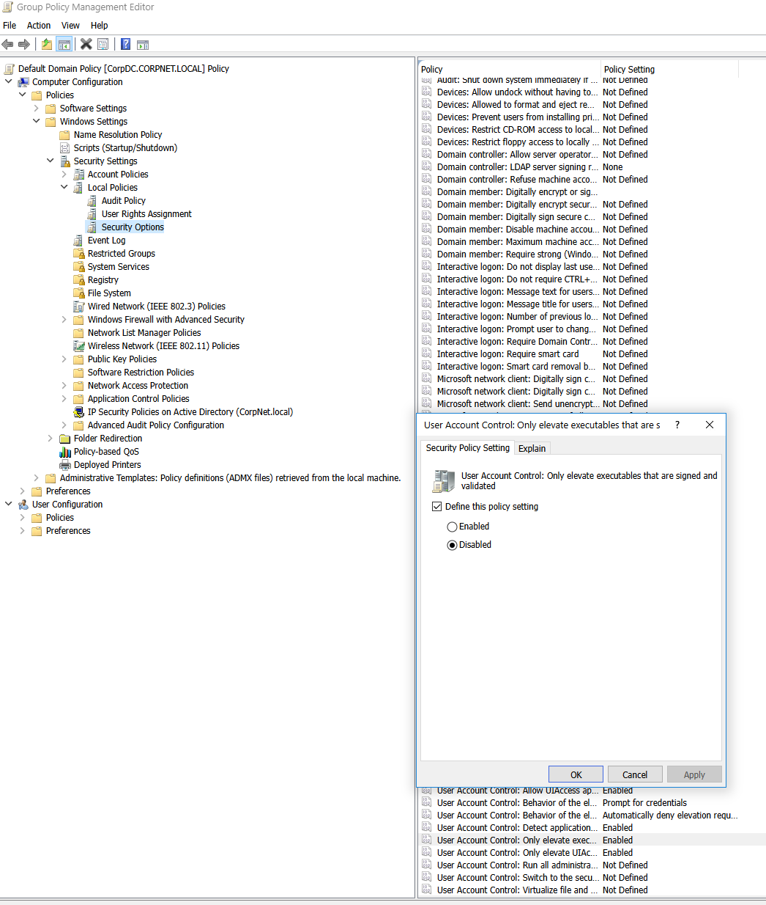

- **Implemented Smart Card Authentication** for multifactor login (where supported)  
  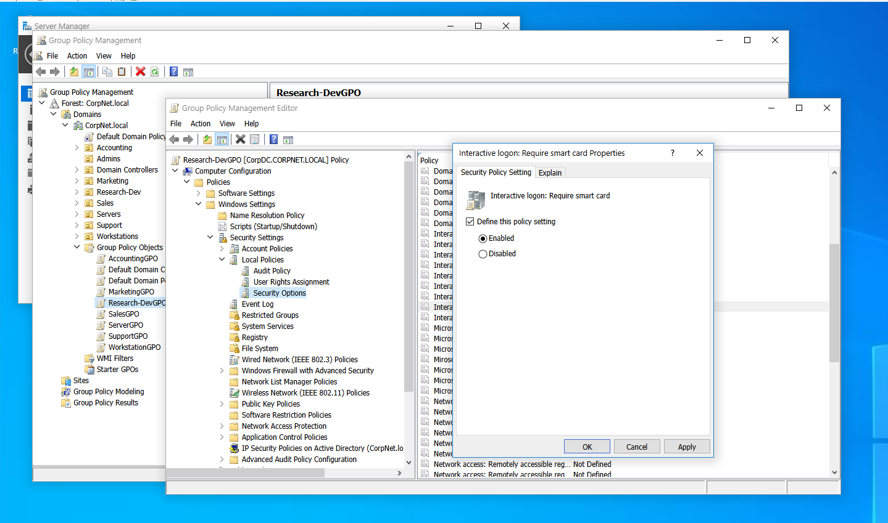

---

## 🐧 Linux User & Group Management

- **Created, renamed, and deleted users** with CLI tools like `useradd`, `usermod`, and `userdel`  
  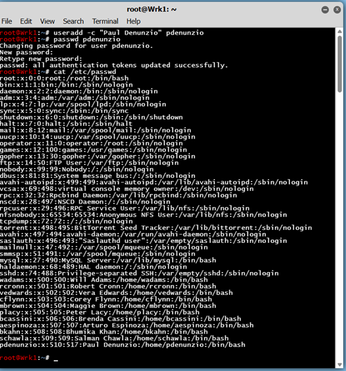  
  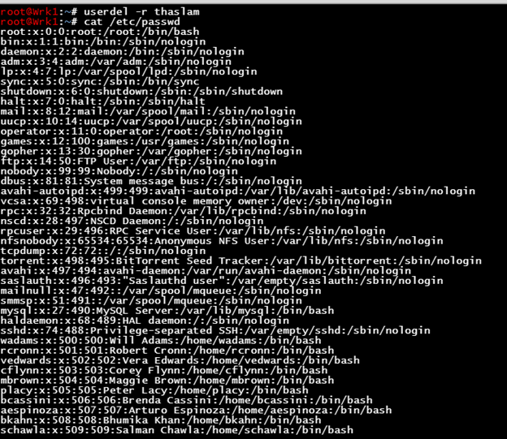  
  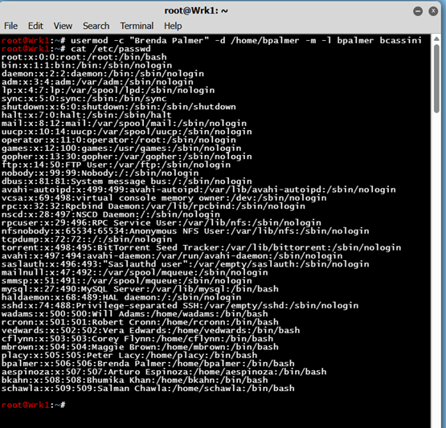

- **Changed passwords and locked accounts** using `passwd` and `usermod -L`  
  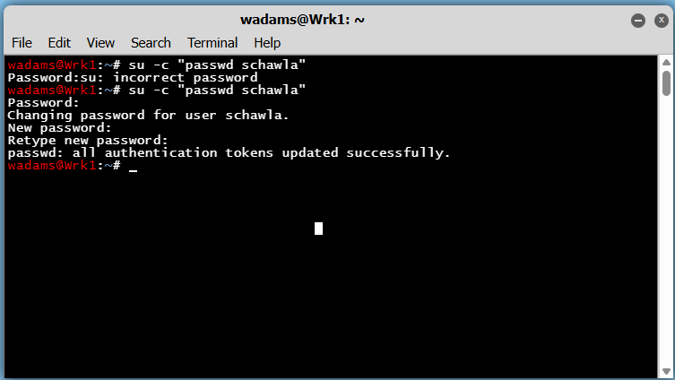  
  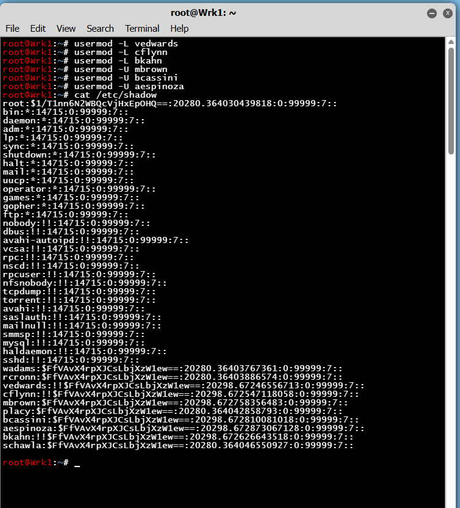

- **Created and managed groups** and added users to the correct security groups  
  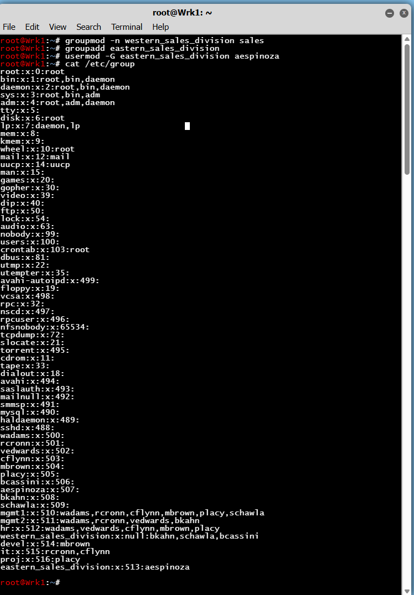

---

> ✅ These foundational IAM skills are crucial whether I’m working toward a cybersecurity analyst role or starting in help desk/system support. They ensure secure and organized access across enterprise systems.

