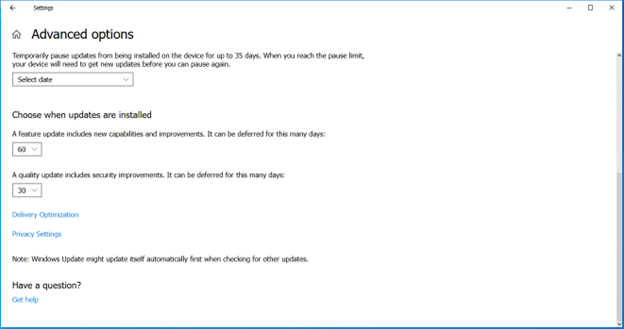

# 🖥️ Windows Endpoint Hardening & Encryption

This project combines four key Windows security labs that focus on protecting endpoints through encryption, patch management, and firewall configuration. These are essential skills for both IT support and cybersecurity roles.

---

## 🔐 Encrypt Files with EFS
- Encrypted the `D:\Finances` folder and all contents using **EFS** (Encrypting File System)
- Prevented unauthorized access to sensitive files on a shared workstation
- Added another user (John) to the encryption certificate for `2023report.xlsx`

**🧠 Why it matters:** EFS helps secure files on shared systems without full-disk encryption.

**📸 Screenshots:**  
  

---

## 💽 Configure BitLocker with TPM
- Enabled **TPM security** from BIOS settings
- Encrypted the entire `C:` drive using **BitLocker**
- Saved recovery key to network share: `\\CorpServer\BU-Office1`
- Used the **new encryption mode** and ran a system check

**🧠 Why it matters:** BitLocker protects lost or stolen drives from unauthorized access, even if removed from the machine.

**📸 Screenshots:**  
  

---

## 🔄 Configure Automatic Updates
- Enabled updates for **Microsoft products**
- Deferred **feature updates** by 60 days and **quality updates** by 30 days
- Enabled automatic downloads for drivers and custom device icons

**🧠 Why it matters:** Keeping systems updated reduces vulnerability windows and improves stability.

**📸 Screenshots:**  
  

---

## 🔥 Configure Microsoft Defender Firewall
- Turned on the **Public network firewall profile**
- Allowed only necessary apps to communicate over public networks:
  - **Key Management Service**
  - **Arch98**
  - **Apconf**
- Scoped firewall exceptions to **Public** profile only

**🧠 Why it matters:** This limits exposure while traveling or using public Wi-Fi, a common source of attacks.

**📸 Screenshots:**  
  
  

---

## ✅ Skills Demonstrated
- Windows file- and disk-level encryption
- Patch management and update deferral policies
- Network-based application control
- Firewall rule configuration
- BIOS-level hardware security setup

---

## 🧠 Applicable Job Roles
- Help Desk / IT Support Technician  
- SOC Analyst / Jr. Cybersecurity Technician  
- System Administrator (Entry-Level)  
- Desktop Support Analyst  
